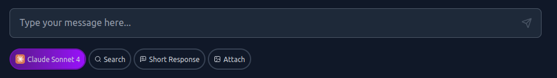

# AI Models & Providers

This document covers the supported AI models and and API key management.

### Supported Providers

#### Groq

Fast inference for open-source models with exceptional speed.

**Models Available:**

- **Llama 3.1 8B Instant** - Ultra-fast responses, ideal for quick questions
- **Llama 3.3 70B Versatile** - Balanced performance and capability
- **Qwen QwQ 32B** - Advanced reasoning with good speed

**Capabilities:**

- Speed optimized inference
- Reasoning and problem-solving
- Programming assistance
- General conversation

**API Key:**

- Get your free key at: [https://console.groq.com/keys](https://console.groq.com/keys)
- Free tier available with generous limits

#### OpenRouter

Access to premium models from multiple providers through a single API. All OpenRouter models can be used with search.

**Models Available:**

- **GPT-4o** - Latest OpenAI model with vision and reasoning
- **GPT-4o-Mini** - Faster, cost-effective GPT-4 variant
- **GPT-4.1** - Enhanced GPT-4 with improved capabilities
- **Claude Sonnet 4** - Anthropic's latest model with excellent reasoning
- **Claude Opus 4** - Most capable Claude model for complex tasks
- **Gemini 2.5 Flash** - Google's fast model with vision support
- **Gemini 2.5 Flash Lite** - Lightweight version of Gemini Flash
- **Gemini 2.5 Pro** - Most capable Gemini model
- **DeepSeek R1** - Advanced open source reasoning model

**API Key:**

- Get your key at: [https://openrouter.ai/keys](https://openrouter.ai/keys)
- Pay-per-use pricing
- Access to cutting-edge models

### API Key Management

#### Server-Side Keys

When API keys are configured during [setup](Setup.md):

- Users don't see these providers in "Bring Your Own Key" settings
- Server handles all API calls and cost
- Models appear as available to all users

#### User-Provided Keys

When users provide their own API keys:

- Users must add keys in Settings → API Keys
- Models only available after key is added
- User's are responsible for paying for their usage

### Switching Model

The currently in-use model can be switched by clicking the model name underneath the chat input.

Additional capabilities can be enabled/disabled depending on what the chosen model supports.

- **Search** - enables web access for loading additional information when generatinga response.
- **Short response** - Tells the model to generate a brief response to the user's prompt.
- **Image Attachments** - Allows the user to attach an image.
