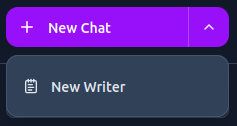

# Writer Mode

Writer mode is an interface for creating or editing a piece of text. The user can manually edit the text and also request that the selected AI model makes a change.

To create a new writer click the dropdown chevron next to the "New Chat" button and click "New Writer":

### History

The writer history can be viewed:

Any request in the history can be selected to view the text at the time of the change. The request can be unselected by clicking it again to show the latest text.

If the user selects a request and then starts editing the text, this new text will become the latest saved text.
